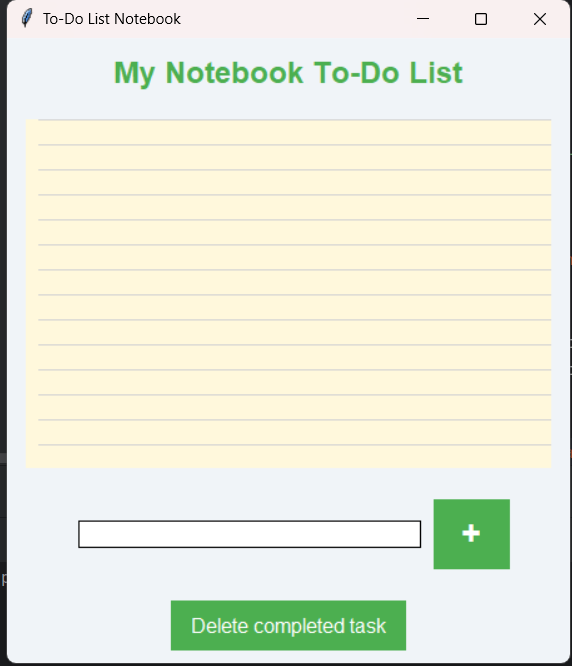

# To-Do List Notebook

A simple to-do list application built with Python's Tkinter library, designed to look like a notebook page. Users can add tasks, mark them as complete, and delete completed tasks with ease.

## Features

- **Notebook-Styled UI**: The app has a light beige, lined background to resemble a notebook page.
- **Add Tasks**: Add tasks using the `+` button.
- **Delete Tasks**: Delete only tasks that are ticked as complete using the "Delete" button.
- **Task Management**: Checkboxes allow users to mark tasks as completed, changing their appearance to indicate completion.

## Screenshot




## Requirements

- **Python 3.x**
- **Tkinter** (Python's standard GUI library, usually included with Python)

## How to Run

1. Clone or download this repository.
2. Open a terminal in the project folder.
3. Run the following command:

    ```bash
    python app.py
    ```

4. The To-Do List Notebook app window should open.

## Code Overview

- **`add_task()`**: Adds a new task with a checkbox to mark it as completed.
- **`toggle_complete()`**: Updates the checkbox color when a task is marked complete or incomplete.
- **`delete_completed_tasks()`**: Deletes tasks that have been checked as completed.
- **`update_task_list()`**: Refreshes the display of tasks.

## Customization

You can easily modify the app to fit your preferences by adjusting:
- **Colors**: Modify the `button_color`, `button_hover_color`, or `notebook_color` variables to customize the theme.
- **Fonts**: Change the `header_font` and `task_font` for different text styles.

## Known Issues

- **Limited Responsiveness**: The UI is best viewed at the specified window size (450x500) but may not scale perfectly on resizing.

## License

This project is open-source and available under the [MIT License](LICENSE).

## Acknowledgements

- **Tkinter**: For providing the GUI framework.
- **Python Community**: For documentation and resources to build this app.

